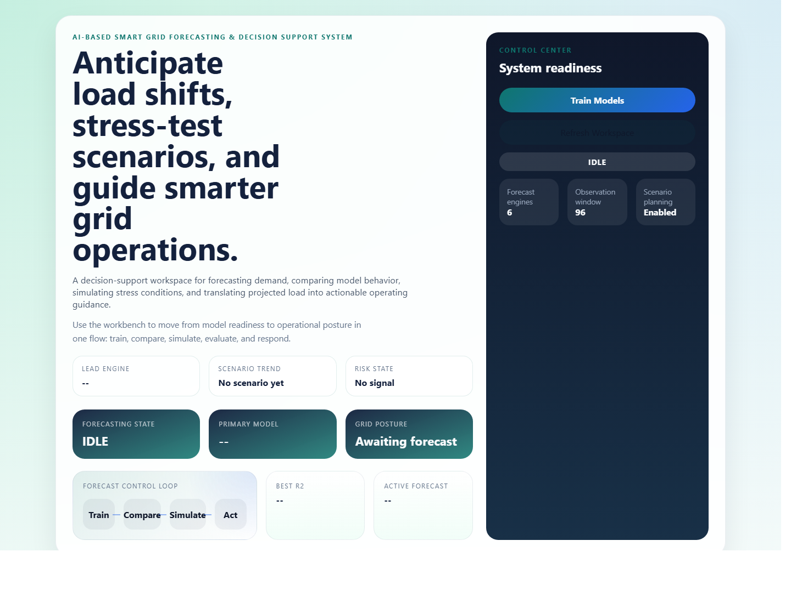

# AI-Based Smart Grid Forecasting & Decision Support System

This is a full-stack web app for smart-grid load forecasting and basic decision support. The app lets a user train forecasting models, compare their performance, inspect predictions, simulate demand changes, and check whether a forecast should trigger a high-load alert.

Live app: https://frontend-lkq5h1yek-sidhantchakus-projects.vercel.app

Backend status: https://backend-1vql9pg8p-sidhantchakus-projects.vercel.app/status



## What It Does

- Trains and compares six lightweight forecasting models.
- Shows MAE, RMSE, and R2 for model comparison.
- Visualizes actual vs predicted values for the hybrid model.
- Predicts the next load value from a 96-point input sequence.
- Simulates demand changes with a scale factor.
- Recommends the best model using the highest R2 score.
- Generates a simple alert when the forecast crosses a selected threshold.

## Tech Stack

- Frontend: React, Vite, Chart.js, Axios
- Backend: FastAPI, Uvicorn
- Forecasting: lightweight CPU-friendly model approximations
- Deployment: Vercel

The original project idea was built around TensorFlow/Keras-style forecasting models. For the hosted Vercel version, I moved the deployed model layer to smaller NumPy-based approximations because TensorFlow made the serverless backend too large to deploy cleanly. The app still keeps the same workflow: train, compare, forecast, simulate, recommend, and alert.

## Project Layout

```text
Smart-Grid-Forecaster/
  backend/
    main.py
    app.py
    models/
    routes/
    utils/
    saved_models/
  frontend/
    src/
    package.json
    vercel.json
  docs/
    smart-grid-forecaster.png
  requirements.txt
  README.md
```

## Running Locally

Start the backend:

```bash
cd Smart-Grid-Forecaster
pip install -r requirements.txt
python -m uvicorn backend.main:app --reload --port 8000
```

Start the frontend in another terminal:

```bash
cd Smart-Grid-Forecaster/frontend
npm install
npm run dev
```

Then open:

```text
http://localhost:5173
```

The frontend defaults to `http://127.0.0.1:8000` for API calls. If you want to set it explicitly, create `frontend/.env` with:

```bash
VITE_API_BASE_URL=http://127.0.0.1:8000
```

## API Endpoints

| Method | Endpoint | Purpose |
|---|---|---|
| `GET` | `/status` | Returns the current training state |
| `POST` | `/train` | Trains all forecasting models |
| `GET` | `/metrics` | Returns MAE, RMSE, and R2 for each model |
| `GET` | `/predictions` | Returns actual vs predicted values for the hybrid model |
| `POST` | `/predict` | Predicts the next value from a 96-point sequence |
| `POST` | `/simulate` | Compares a base forecast with a scaled-demand scenario |
| `GET` | `/recommendation` | Returns the model with the highest R2 |
| `POST` | `/alert` | Checks a forecast against a threshold |

## Notes

This project is meant to demonstrate the full forecasting workflow more than to chase perfect accuracy. The interesting part is the end-to-end flow: taking a sequence, training and comparing models, showing a forecast, testing a scenario, and turning the result into a simple operating recommendation.

The code is intentionally modular so a heavier TensorFlow/Keras training pipeline can be plugged back in later if the backend is moved to a long-running server instead of serverless hosting.
